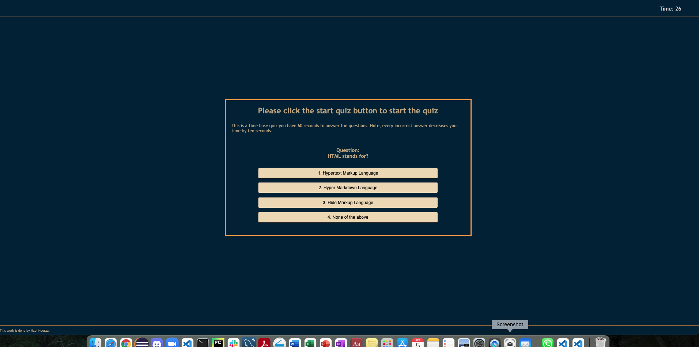

# code-quiz-mnn

This is a timer set code quiz app that the user will be presented with multiple choices questions. When the user answer the correct answer, they would see the next question, but if the user choose the wrong answer 10 seconds will be subtracted from the rest of their time. After that their hiscores will be saved along with their initals. I really enjoyed working on this code-quiz homework project. HTML, CSS, and Javascript are being used in this app. 

 https://mnoorzai21.github.io/code-quiz-mnn/
 

